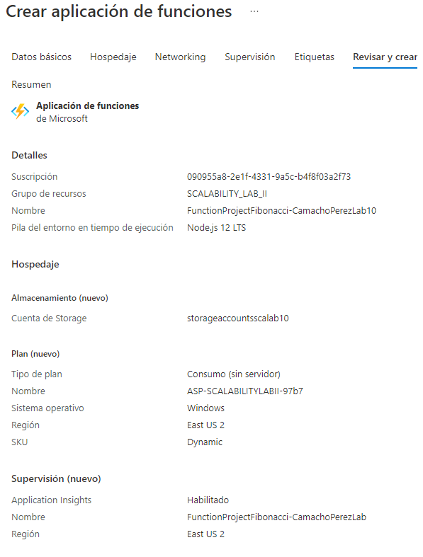

### Escuela Colombiana de Ingeniería
### Arquitecturas de Software - ARSW

## Escalamiento en Azure con Maquinas Virtuales, Sacale Sets y Service Plans

### Dependencias
* Cree una cuenta gratuita dentro de Azure. Para hacerlo puede guiarse de esta [documentación](https://azure.microsoft.com/es-es/free/students/). Al hacerlo usted contará con $100 USD para gastar durante 12 meses.
Antes de iniciar con el laboratorio, revise la siguiente documentación sobre las [Azure Functions](https://www.c-sharpcorner.com/article/an-overview-of-azure-functions/)

### Parte 0 - Entendiendo el escenario de calidad

Adjunto a este laboratorio usted podrá encontrar una aplicación totalmente desarrollada que tiene como objetivo calcular el enésimo valor de la secuencia de Fibonnaci.

**Escalabilidad**
Cuando un conjunto de usuarios consulta un enésimo número (superior a 1000000) de la secuencia de Fibonacci de forma concurrente y el sistema se encuentra bajo condiciones normales de operación, todas las peticiones deben ser respondidas y el consumo de CPU del sistema no puede superar el 70%.

### Escalabilidad Serverless (Functions)

1. Cree una Function App tal cual como se muestra en las  imagenes.

2. Instale la extensión de **Azure Functions** para Visual Studio Code.

3. Despliegue la Function de Fibonacci a Azure usando Visual Studio Code. La primera vez que lo haga se le va a pedir autenticarse, siga las instrucciones.

4. Dirijase al portal de Azure y pruebe la function.

5. Modifique la coleción de POSTMAN con NEWMAN de tal forma que pueda enviar 10 peticiones concurrentes. Verifique los resultados y presente un informe.

6. Cree una nueva Function que resuleva el problema de Fibonacci pero esta vez utilice un enfoque recursivo con memoization. Pruebe la función varias veces, después no haga nada por al menos 5 minutos. Pruebe la función de nuevo con los valores anteriores. ¿Cuál es el comportamiento?.

Codigo de fibonacci con recurrencia:

### Prueba 1

## Prueba 2

Con respecto a las peticiones se ejecutarón correctamente, viendo un incremento en el procesamiento al momento de la ejecución, adicional a ello la prueba #2 ejecutada pasados los 5 minutos tiene un tiempo de ejecución similar a la prueba #1, sin embargo la utilización de memoria es menor.

**Preguntas**

* ¿Qué es un Azure Function?

Azure Functions es un servicio en la nube disponible bajo demanda que proporciona toda la infraestructura y los recursos continuamente actualizados necesarios para ejecutar sus aplicaciones. Usted se concentra en los fragmentos de código que más le importan y Functions se encarga del resto. Functions proporciona procesamiento sin servidor para Azure.

* ¿Qué es serverless?

Es un modelo de ejecución en el que el proveedor en la nube (AWS, Azure o Google Cloud) es responsable de ejecutar un fragmento de código mediante la asignación dinámica de los recursos. Y cobrando solo por la cantidad de recursos utilizados para ejecutar el código. El código, generalmente, se ejecuta dentro de contenedores sin estado que pueden ser activados por una variedad de eventos que incluyen solicitudes HTTP, eventos de base de datos, servicios de colas, alertas de monitoreo, carga de archivos, eventos programados (trabajos cron), etc. El código que se envía a al proveedor en la nube para la ejecución es generalmente en forma de una función.

* ¿Qué es el runtime y que implica seleccionarlo al momento de crear el Function App?

Para implementar funciones integradas en un lenguaje de programación, durante el tiempo de ejecución (ejecución)de un programa de computadora. Esto a menudo incluye funciones de entrada y salida, o para la gestión de la memoria.

* ¿Por qué es necesario crear un Storage Account de la mano de un Function App?

Contiene todos los objetos de datos de Azure Storage: blobs, recursos compartidos de archivos, colas, tablas y discos. La cuenta de almacenamiento proporciona un espacio de nombres único para los datos de Azure Storage que es accesible desde cualquier lugar del mundo mediante HTTP o HTTPS.

* ¿Cuáles son los tipos de planes para un Function App?, ¿En qué se diferencias?, mencione ventajas y desventajas de cada uno de ellos.

Consumption: Ofrece escalabilidad dinámica y factura solo cuando la aplicación es ejecutada, tiene un timeout es de 5 minutos y brinda una memoria máxima de 1.5 GB por instancia, un almacenamiento de 1 GB y un máximo número de instancias de 200.

Premium: Ofrece escalabilidad dinámica, se factura por el número en segundos de core y la memoria usada en las distintas instancias, puede tener timeouts ilimitados, memoria por instancia de 3.5 GB y un almacenamiento de hasta 250 GB, finalmente ofrece un máximo de 100 instancias.

Dedicated: El cliente puede implementar manualmente la escalabilidad, puede tener timeouts ilimitados, memoría por instancia de 1.7 GB y una capacidad de almacenamiento hasta de 1000 GB y el numero de instancias es máximo 20. En este plan se paga lo mismo que por otros recursos de App Service, como las aplicaciones web

* ¿Por qué la memoization falla o no funciona de forma correcta?

No funciona de la manera correcta porque los numeros que se generan son muy grandes, esto hace que la memoria se consuma dado esto la memorizacion no funciona.

* ¿Cómo funciona el sistema de facturación de las Function App?

Functions se factura según el consumo de recursos observado, medido en gigabytes por segundos (GB-s). El consumo de recursos observado se calcula multiplicando el tamaño medio de memoria en GB por el tiempo en milisegundos que dura la ejecución de la función. La memoria que una función utiliza se mide redondeando al alza a los 128 MB más cercanos hasta un tamaño de memoria máximo de 1.536 MB, y el tiempo de ejecución se redondea al alza a los 1 ms más cercanos. Para la ejecución de una única función, el tiempo de ejecución mínimo es de 100 ms y la memoria mínima es de 128 MB, respectivamente. Los precios de Functions incluyen una concesión gratuita al mes de 400.000 GB-segundos.

